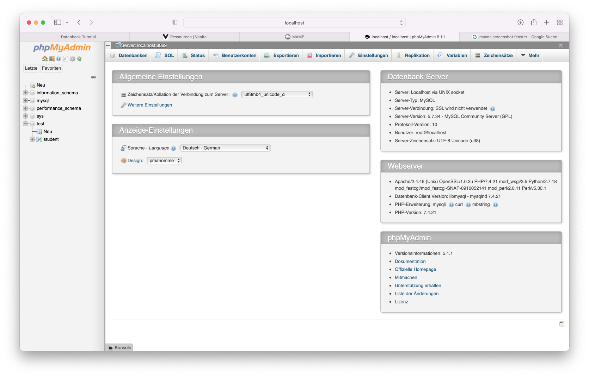

# DB Connect
DB Connect ist eine einfache PHP-Klasse zur Datenbank-Konnektivität.

## Was ist eine Datenbank
Eine Datenbank ist im Prinzip nichts anderes als eine Ansammlung
von Daten in geordneter Struktur. Es kann sich dabei um eine Tabelle,
aber auch um eine durch Komma getrennte Liste handeln.

In der Webentwicklung werden sehr gerne sogenannte MySQL-Datenbanken verwendet.
Dabei handelt es sich um eine relationale Datenbank, d.h. die einzelnen Spalten
der verschiedenen Tabellen können in einer Beziehung zueinander stehen. Aber dazu
später mehr.

MySQL-Datenbanken werden sehr gerne mit der Weboberfläche **phpMyAdmin** verwaltet.

## Unterschiede zwischen php und Javascript
Php ist eine serverseitige Programmiersprache, die wir dazu verwenden können,
auf dem Webserver Aktionen ablaufen zu lassen. Javascript dagegen wird verwendet,
um auf dem Computer, der eine Website aufruft, Aktionen ablaufen zu lassen.

### Beispiele

**Javascript** können wir benutzen, um den Browser des Nutzers zu steuern, zum Beispiel
können wir ein neues Browserfenster öffnen lassen (Popups) oder wir aktivieren
die Webcam.

**Php** hingegen kann zum Beispiel auf das Dateisystem des Webservers oder eben auf die
Datenbank des Webservers zugreifen. Mit php könnten wir aber auch eine E-Mail versenden.

